# OTA Protocol

The OTA layer is versioned and type-multiplexed. It carries RC, sync, telemetry,
bind, and MSP-oriented payloads without exposing radio-driver details above the
PHY boundary.

Terminology:

- `ota_frame` is the whole over-the-air frame.
- `payload` is only the data inside the frame.
- `rc_payload` is packed RC channel data.
- `telemetry_payload` is telemetry data inside an OTA telemetry frame.

```mermaid
graph TD
    subgraph StandardFrame["Standard RC Frame (12 Bytes Total)"]
        StdHeader["OTA Header<br/>(1 Byte / 8 bits)"]:::header

        subgraph StdPayload["Packed RC Payload (11 Bytes / 88 bits)"]
            CH1["CH1 (11 bits)"]:::channel
            CH2["CH2 (11 bits)"]:::channel
            CH3["CH3 (11 bits)"]:::channel
            CH4["CH4 (11 bits)"]:::channel
            CH5["CH5 (11 bits)"]:::channel
            CH6["CH6 (11 bits)"]:::channel
            CH7["CH7 (11 bits)"]:::channel
            CH8["CH8 (11 bits)"]:::channel
        end
    end

    subgraph CompactFrame["Compact Shrink RC Frame (8 Bytes Total)"]
        CmpHeader["OTA Header<br/>(1 Byte / 8 bits)"]:::header

        subgraph CmpPayload["Packed RC Payload (7 Bytes / 56 bits)"]
            CCH1["CH1 (10 bits)"]:::channel
            CCH2["CH2 (10 bits)"]:::channel
            CCH3["CH3 (10 bits)"]:::channel
            CCH4["CH4 (10 bits)"]:::channel
            CCH5["CH5 (10 bits)"]:::channel
            SeqAck["Seq/Ack (6 bits)"]:::meta
        end
    end

    classDef header fill:#d97706,stroke:#9a3412,stroke-width:2px,color:#fff;
    classDef channel fill:#0284c7,stroke:#075985,stroke-width:2px,color:#fff;
    classDef meta fill:#4b5563,stroke:#1f2937,stroke-width:2px,color:#fff;

    class StdHeader,CmpHeader header;
    class CH1,CH2,CH3,CH4,CH5,CH6,CH7,CH8,CCH1,CCH2,CCH3,CCH4,CCH5 channel;
    class SeqAck meta;
```

The detailed frame implementation lives under `lib/xlrs/ota/`.

See [architecture.md](architecture.md), [configuration.md](configuration.md), and
[terminology.md](terminology.md) for current constraints.
