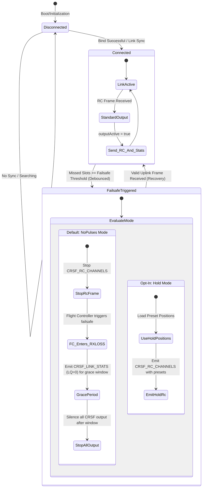

# Safety And Failsafe

Default failsafe mode is `NoPulses`.

When the link is not valid and `NoPulses` is active, the RX stops emitting CRSF
RC channel frames so the flight controller can enter RXLOSS and own aircraft
policy. `Hold` mode is available as an explicit configuration option.

Safety-sensitive areas:

- CRSF output gating.
- Failsafe thresholds and missed-uplink-slot accounting.
- Link-state transitions.
- RF timing and scheduler deadlines.
- RF region tables and TX power limits.
- Dynamic power emergency boost behavior.

Changes here should include native tests where possible and hardware validation
notes where native tests cannot prove the behavior.
