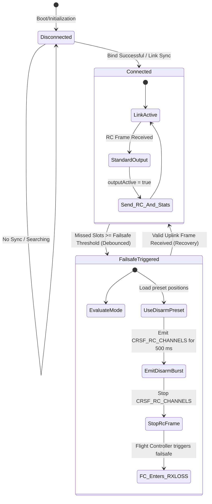

# Safety And Failsafe

After an active uplink times out, the RX first emits a short CRSF RC disarm burst
and then stops RC channel frames so the flight controller can enter RXLOSS and
own aircraft policy.

The disarm burst lasts 500 ms. Its preset keeps roll/pitch/yaw centered, drives
throttle low, and drives all AUX channels to 1000 us so an AUX ARM channel is not
held high during link loss.

```mermaid
stateDiagram-v2
    [*] --> Disconnected : Boot/Initialization

    state Connected {
        [*] --> LinkActive
        LinkActive --> StandardOutput : RC Frame Received
        StandardOutput --> Send_RC_And_Stats : outputActive = true
        Send_RC_And_Stats --> LinkActive
    }

    Disconnected --> Connected : Bind Successful / Link Sync

    Connected --> FailsafeTriggered : Missed Slots >= Failsafe Threshold (Debounced)

    state FailsafeTriggered {
        [*] --> EvaluateMode

        [*] --> UseDisarmPreset : Load preset positions
        UseDisarmPreset --> EmitDisarmBurst : Emit CRSF_RC_CHANNELS for 500 ms
        EmitDisarmBurst --> StopRcFrame : Stop CRSF_RC_CHANNELS
        StopRcFrame --> FC_Enters_RXLOSS : Flight Controller triggers failsafe
    }

    FailsafeTriggered --> Connected : Valid Uplink Frame Received (Recovery)
    Disconnected --> Disconnected : No Sync / Searching
```

Safety-sensitive areas:

- CRSF output gating.
- Failsafe thresholds and missed-uplink-slot accounting.
- Link-state transitions.
- RF timing and scheduler deadlines.
- RF region tables and TX power limits.
- Dynamic power emergency boost behavior.

Changes here should include native tests where possible and hardware validation
notes where native tests cannot prove the behavior.
