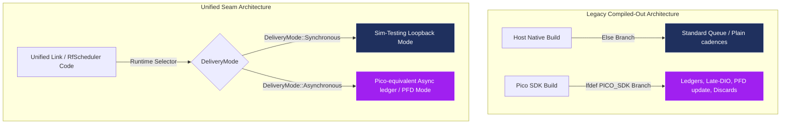
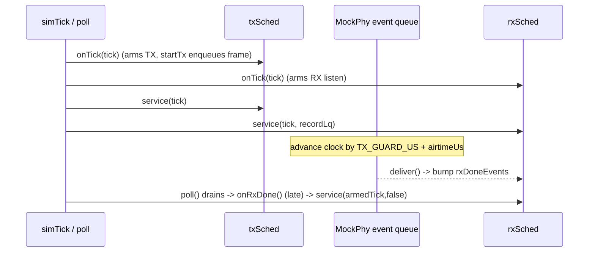
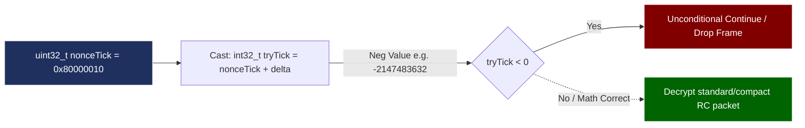
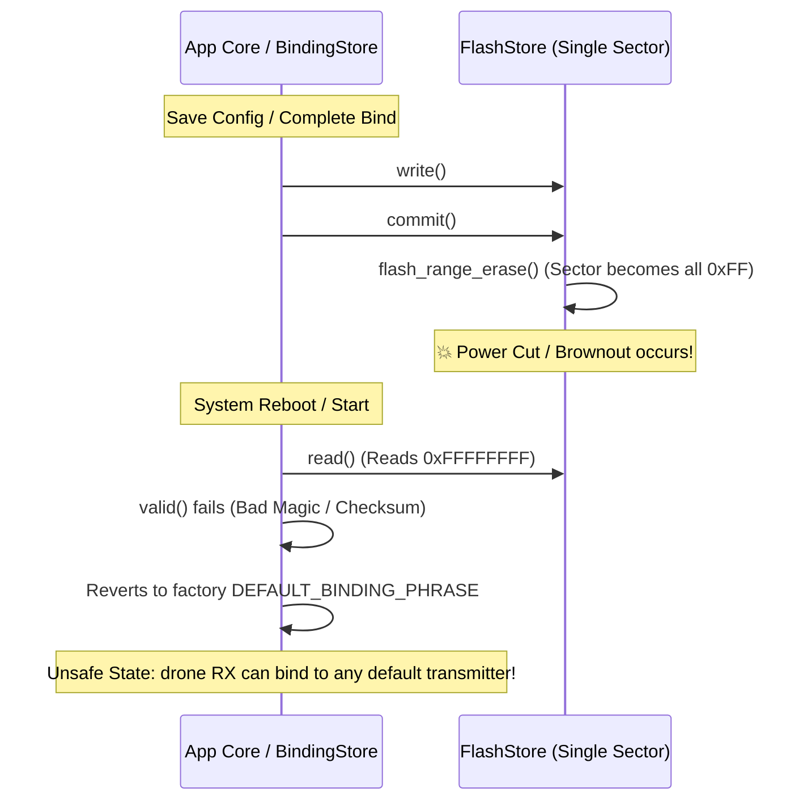

# Simulation & Mock Test Enhancement Plan

This plan extends the native host-test environment (`test/` suite, `MockPhy`, `SimEnvironment`) to reproduce and guard the safety-critical edge cases, uptime bugs, and races tracked in [open-issues.md](open-issues.md) — without RP2040 hardware or a radio.

It has been revised after a code-grounded verification pass. The key correction:
**making the sim asynchronous is necessary but not sufficient.** Most of the hardware-only logic lives behind `#if defined(XLRS_PICO_SDK)`, and the host build does **not** define that macro (`test/CMakeLists.txt`), so those branches are not compiled into the test binary at all. Changing *when* `onRxDone` fires does not change *which branch* runs. Therefore OI-016 (host-reachable hardware paths) is a **prerequisite**, not a peer deliverable.

## What changed versus the original draft

- Added **Section 0** (OI-016 seam) as a hard prerequisite for the async harness and for OI-004 / OI-012 / OI-015.
- Removed the incorrect claim that an async `MockPhy` alone exercises the `#if defined(XLRS_PICO_SDK)` paths.
- Added a **testability classification** so work is sequenced correctly.
- Fixed feasibility gaps: `PhyConfig` has no airtime field; the host `FlashStore` is a no-op RAM buffer with no erase/partial-program model; private state needs explicit test seams; `forceTickCount` must also set `_locked`.
- Reconciled the failsafe-latency threshold with `FAILSAFE_MISS = 10` (a flat ≤150 ms bound is physically impossible at L50).
- Made explicit that Sections 2–5 are **red-then-green** regression guards: they are expected to *fail on current code* and pass once the corresponding fix lands.
- Added **Section 6** (invariant & chaos harness) so the suite does discovery, not just regression — Sections 1–5 prove the known 16 are fixed; Section 6 is built to surface the 17th.

## Testability classification

| Reachable on host today (common code) | Needs the OI-016 seam first (Pico-only code) |
| --- | --- |
| OI-001 (nonce `int32` cast is outside the ifdef) | OI-004 (`applyLockedRxPhaseResync` is `#if XLRS_PICO_SDK`) |
| OI-003 (OTA codec) | OI-012 (HW LQ ledger `advanceHwUplinkLqSlot` is Pico-only) |
| OI-006 (StubbornTelemetry — plain classes) | OI-015 (RX-locked overrun discard is Pico-only) |
| OI-009 (event-counter compare; needs a counter seam) | Faithful late-DIO ordering / double-`service()` drain |
| OI-011 (LQ holdoff at `Link::service()` is common code) | |
| OI-013 (`TlmDown` accept + `_power.update` is common code) | |

**Execution order:** land the host-reachable tests first as quick regression guards (OI-001, OI-003, OI-006, OI-009, OI-011, OI-013), do the OI-016 seam in parallel, then build the async harness on top of the seam to reach OI-004 / OI-012 / OI-015.

---

## 0. Prerequisite — Make Hardware Paths Host-Reachable (OI-016)

**Problem.** The timing-critical logic — `applyLockedRxPhaseResync()`, the async LQ ledgers (`advanceHwUplinkLqSlot` / `noteHwUplinkDecode`), telemetry-RX arming, the `onRxDone` hardware branch, and the `poll()` RX-locked overrun discard — is all `#if defined(XLRS_PICO_SDK)`. The host suite compiles the `#else` branch, which for several issues is a *different and often more-correct* path (e.g. the host `onRxDone` applies `intervalUs + adjUs`, while the Pico `applyLockedRxPhaseResync` discards it — that discard **is** OI-004).

### Architectural Solution
We must lift the timing, ledger, and PFD logic out from behind the build macro into a build-agnostic path selected by an injectable policy mode rather than raw `#ifdef` compiler gating.



### Approach
- Introduce a `DeliveryMode { Synchronous, Asynchronous }` policy (or an injected clock + delivery policy) on the scheduler so the *same* compiled code runs both the current sim flow and the hardware flow.
- Keep `#if defined(XLRS_PICO_SDK)` only around true SDK calls (GPIO, SPI, `hardware_timer`), not around link/scheduler decision logic.
- Host tests then select `Asynchronous` to exercise the real ordering; firmware uses the same code with real ISRs driving it.

This is the gate. Without it, Section 1 builds a faithful-looking harness that still runs the `#else` branch and gives false confidence on OI-004/012/015.

---

## 1. Async Delivery Timeline In The Sim

**Verified accurate:** today `MockPhy::startTx()` calls `_peer->deliver()` → `_onRxDone()` **synchronously**, inside `onTick()`, before `service()` runs (`SimEnvironment::simTick`). On hardware, `onRxDone` fires later from a DIO1 IRQ, after `service()`. This hides late-arrival races, PFD-adjustment behavior, and async-ledger skew.

### Solution — event-driven timeline (depends on Section 0):



Code shape:

```cpp
struct ScheduledEvent {
    uint32_t timestampUs;
    uint8_t  data[OTA16_LEN];
    uint8_t  len;
    int16_t  rssiDbm;
    int8_t   snr;
};
std::vector<ScheduledEvent> _eventQueue;   // in MockPhy
```

Required corrections to the original design:

1. **Airtime source.** `MockPhy` has no `RateConfig`, and `PhyConfig` has **no airtime field** (it carries `freqMHz`, `sf`, `cr`, `payloadLen`, …). Add `airtime8Us` / `airtime16Us` to `PhyConfig` (populated by `makePhyConfig`) or inject airtime when the scheduler arms TX. The draft's `_rate.airtime16Us` inside `startTx` will not compile as written.
2. **Drive via the event counter + `poll()` drain**, not a direct `onRxDone()` call, so the catch-up / late-DIO logic (and OI-015) is actually exercised.
3. **Replicate the double `service()`**: hardware calls `service(nextTick)` from the poll loop *and* `service(_armedTick, false)` from `onRxDone`. The sim must do both, honoring the `recordLq` flag, or the LQ-ledger behavior won't match.

Targets unlocked (with Section 0): OI-004, OI-012, OI-015, plus general late-arrival regression coverage.

---

## 2. Uptime & Wrap Boundaries (OI-001, OI-009)

Reachable on host **today** — these are common code, not Pico-only.

- `OI-001`: the `(int32_t)nonceTick` cast and `if (tryTick < 0) continue;` in `tryNonceTicks()` are outside the `#ifdef` (only `maxDelta` differs: 16 vs 1), so the wrap bug triggers on host.

### Code-Grounded Cast Leak (OI-001)
At `D250` (4000 µs nominal tick interval), the `int32_t` cast of `nonceTick` crosses into negative space (at 2³¹) after:
$$\frac{2^{31} \text{ ticks} \times 4 \text{ ms/tick}}{1000 \text{ ms/s} \times 3600 \text{ s/h} \times 24 \text{ h/d}} \approx 99.42 \text{ days}$$
At `F1000` (1000 µs nominal tick interval), it occurs in only **24.85 days**.



**Test seams (private state):**

```cpp
#if defined(XLRS_HOST_TEST)   // add this define in test/CMakeLists.txt
void Link::forceTickState(uint32_t newTick) {
    _tick = newTick;
    _locked = true;                       // REQUIRED: effectiveTxTick() ignores
    _syncAnchorTxTick   = newTick - 100;  // the anchor unless _locked is true
    _syncAnchorLocalTick = newTick - 100;
}
// RfScheduler needs its own seam — the atomics cannot be reached via
// fireSimTimerTick() at 0xFFFFFFF0:
void RfScheduler::forceEventCounters(uint32_t ticks, uint32_t rx, uint32_t processed);
#endif
```

Tests (`test/timing_tests.cpp`):

- `test_uptime_nonce_wrap_int32`: set tick to `0x7FFFFF00`, run 500 RC exchanges across the wrap. **Expected: fails on current code, passes after OI-001 fix.**
- `test_isr_event_counter_wrap`: force counters near `0xFFFFFFF0`, inject 30 events, assert all are processed (respecting `MAX_TICK_CATCHUP`). **Fails on current code (the `current > last` compare stalls after wrap); passes after OI-009 fix.**

---

## 3. Power-Cut Persistence (OI-002)

**Gap to close first:** the erase-then-program hazard only exists in the Pico branch of `FlashStore.cpp` (`flash_range_erase` then `flash_range_program`). The **host** branch is a no-op RAM buffer (`write()` = memcpy, `commit()` = `return true`) with no erase window and no partial writes — `setFailOnCommit(true, 5)` has nothing to interrupt.

So step one is to rework the host `FlashStore` to *model* the real sequence:

```cpp
class MockFlashDevice {                    // host-only
    void erase();                          // sets sector to 0xFF
    void program(size_t off, const uint8_t* d, size_t n);  // incremental
    void setCutAfterWrites(size_t n);      // throw/stop mid-program to model brownout
};
```

### Flash Corruption Sequence
When writing configuration updates, an interrupted write leaves the single-sector storage containing corrupted metadata (`0xFF`). Upon restart, the system falls back to default binding identities:



Test (`test/flash_tests.cpp`) — `test_flash_power_loss_recovery`:

1. Persist a unique, non-default binding phrase.
2. Begin a config save / bind commit.
3. `setCutAfterWrites(5)` (after erase, before payload completes).
4. "Reboot": re-call `FlashStore::begin()` + `BindingStore::begin()`.
5. Assert recovery of the last known-good phrase, **not** a revert to `DEFAULT_BINDING_PHRASE`.

**Expected: fails on current single-sector code; passes once the two-slot journal (OI-002 proposed fix) exists.** This test is the executable spec for that journal.

---

## 4. Telemetry State-Machine Resiliency (OI-006)

Fully feasible today — `StubbornSender` / `StubbornReceiver` are plain host classes. Confirmed mechanism: `receiveAck()` advances only when `ackSeq == _currentSeq + 1`; `StubbornReceiver._expectedSeq` starts at 0.

### The Deadlock State Loop
An independent reboot of either peer resets `_expectedSeq` to zero. Because the sender does not reboot, it continues attempting to transmit its last sequence number (e.g., 5), leading to a permanent channel hang:

```mermaid
stateDiagram-v2
    state "Transmitter (StubbornSender)" as TX
    state "Receiver (StubbornReceiver)" as RX

    [*] --> normal_link
    normal_link --> advanced_transfer : Send chunk 0..4 ok
    advanced_transfer --> RX_Reboot : RX brownout / FC resets
    
    state advanced_transfer {
        TX: _currentSeq = 5
        TX: Expects ACK = 6
    }
    
    state RX_Reboot {
        RX: _expectedSeq = 0
    }

    RX_Reboot --> deadlock_state : TX sends seq=5
    
    state deadlock_state {
        TX: Sends chunk (seq=5)
        RX: Receives seq=5 (Expected 0)
        RX: Returns outAckSeq = 0
        TX: Receives ACK=0 (Expected 6)
        TX: Rejects ACK & retries seq=5
    }
    deadlock_state --> deadlock_state : 🔄 Stuck in infinite retry loop
```

Test (`test/telemetry_tests.cpp`) — `test_telemetry_independent_reboot`:

1. Connected link; queue a ~60-byte payload in `StubbornSender`.
2. Transfer 2 chunks (advance both sequence numbers).
3. Replace the receiver with a fresh `StubbornReceiver` (resets `_expectedSeq`).
4. Run ~50 ticks; assert the stream resynchronizes and completes.

**Expected: fails on current code (permanent deadlock); passes once desync handling lands.**

---

## 5. Security & Failsafe Integrity (OI-011, OI-012, OI-013)

`test_unauthenticated_tlmdown_does_not_steer_dynamic_power` (OI-013) — reachable today (the `TlmDown` accept path and `_power.update()` are common code):

- Enable dynamic power on TX; via a **public** `MockPhy` inject seam (currently `deliver()` is private), feed forged unauthenticated `TlmDown` frames with extreme stats.
- Assert TX power is unchanged. **Fails on current code (power *does* move); passes once `TlmDown` is authenticated or excluded from power control.**
- File: `test/power_tests.cpp`.

`test_failsafe_onset_latency` (OI-011) — reachable today (the LQ holdoff at `Link::service()` is common code; `simTick(..., txOn=false)` already exists):

- Establish LQ ≈ 100%, then stop TX; measure ticks until `rx.state() == Failsafe` and `outputActive() == false`.
- **Threshold must be rate-aware.** A flat `≤150 ms` is impossible: with `FAILSAFE_MISS = 10` consecutive missed uplink slots, the floor at L50 (20 ms/slot) is **≥200 ms** before failsafe can even fire. Suggested bound: `max(FAILSAFE_MISS * uplinkSlotPeriod, absolute_floor)` per rate — or, better, drive the OI-011 fix toward an **absolute-time** failsafe trigger and assert a single wall-clock bound across rates (which then *requires* revisiting `FAILSAFE_MISS` for slow rates).

> OI-012 (LQ-ledger freeze) is **not** reachable on host without Section 0 — the ledger that can freeze is `#if defined(XLRS_PICO_SDK)`. Test it via the async harness once the seam exists: stall the uplink-slot stream and assert `lqUp` decays / failsafe still fires.

---

## 6. Invariant & Chaos Harness — Finding The Next Issue

Sections 1–5 are **example-based** tests built backwards from the known issue
list: each reproduces one documented OI and is red-then-green. They prove we fixed
*these sixteen* — they do not look for the seventeenth. This section adds a
**generative / invariant-based** layer on the *same* infrastructure (the async
timeline from Section 0/1, the boundary seams from Section 2, the fault injection
from Section 3) so the harness keeps finding *unknown* bugs.

The shift is: stop asserting "this specific input produces this specific output,"
and start asserting "this property holds for *all* inputs," then generate inputs
until something breaks.


### 6.1 Invariants (properties that must hold for every scenario)

These are checked after every simulated tick, in every test, regardless of the
input. Each generalizes a known issue into the whole class it belongs to. Names
follow the glossary (`tick`, `slot`, `rf_channel`, `uplink`/`downlink`).

| ID | Invariant | Surfaces (unknown bug class) | Generalizes |
| --- | --- | --- | --- |
| I1 | When RX is locked, decode success never depends on the *absolute* tick value (only on the TX↔RX mapping) | any tick/nonce desync | OI-001, #8.5 |
| I2 | Time from last valid `uplink` decode to Failsafe + output-gating is `≤` a rate-scaled bound, always | stale RC streaming on any rate/path | OI-011 |
| I3 | `lqUp` never reads `≥ FAILSAFE_LQ_HOLDOFF` after K ticks with zero decodes | any LQ-ledger freeze/stall | OI-012 |
| I4 | `outputActive() == true` implies a valid RC decode within the failsafe window | output-gating holes | OI-011/012 |
| I5 | When both peers are locked, the RX-armed `rf_channel` equals the TX `rf_channel` for that tick | FHSS desync under stress | #8.4, OI-015 |
| I6 | Failsafe is always *reachable* from Connected for any loss pattern (no permanent Connected latch) | stuck-connected states | OI-012 |
| I7 | A successful decode implies matching UID / sync word (no cross-talk, no unsigned acceptance) | spoof/cross-talk acceptance | OI-013 |
| I8 | Behavior at tick `T` equals behavior at `T + 2^k` for every counter in play (wrap invariance) | wrap/overflow *anywhere*, not just `tryNonceTicks` | OI-001, OI-009 |

```cpp
// Checked after every simulated tick in any scenario; a violation prints the seed.
struct InvariantMonitor {
    void check(const Link& tx, const Link& rx, const RfScheduler& rxSched, uint32_t tick) {
        // I2: rate-scaled failsafe latency bound (requires a test seam exposing age)
        if (rx.lastValidUplinkAgeUs() > failsafeBoundUs(rx.rateIndex()))
            REQUIRE(rx.state() == LinkState::Failsafe && !rx.outputActive());
        // I4: no stale output
        if (rx.outputActive())
            REQUIRE(rx.lastValidUplinkAgeUs() <= failsafeBoundUs(rx.rateIndex()));
        // I3, I5, I6, I7 similar; I1/I8 handled by the metamorphic runner (6.4).
    }
};
```

### 6.2 Chaos generator (seeded randomness through the async timeline)

Drive the async harness with a seeded RNG so any failure reproduces exactly (print
the seed on violation). The knobs map directly to the hardware stressors that
produced the bench bugs:

```cpp
struct ChaosConfig {
    uint64_t seed;
    float    uplinkLossProb;      // per uplink slot — RF dropout
    float    downlinkLossProb;    // per telemetry slot
    uint8_t  maxCore1StallTicks;  // skip poll() N ticks -> exercise the overrun path
    int32_t  clockSkewUsRange;    // jitter delivery timestamps in/out of PFD capture
    uint32_t rebootEveryTicks;    // 0 = never; else reconstruct a peer mid-stream
};
```

Run thousands of seeds × all five rate profiles with the invariant monitor active.
This is where genuinely *unknown* races appear — random core-1 stalls + loss +
skew is a search space no hand-written example covers. (Requires Section 0; the
timing invariants are only meaningful on the async path.)

### 6.3 Codec & framing fuzzing (available today)

Feed random byte strings and lengths into `otaDecodeSync` / `otaDecodeRc` /
`otaDecodeTlmDown` / the MSP path. Assert: no out-of-bounds read, no crash, and
the frame is either rejected or round-trips cleanly. OI-003 (truncated Sync) was
*one* case found by hand; a length/content fuzzer finds the rest. This runs on
common code with no seam needed.

### 6.4 Metamorphic & differential checks

- **Tick-shift metamorphic (I1/I8):** run a scenario, then re-run it with every
  tick shifted by a constant offset (including `+2^31` and `+2^32 - δ`). Decode
  outcomes and state transitions must be *identical*. Any divergence is a
  hidden absolute-tick dependency — this finds wrap bugs beyond the one in
  `tryNonceTicks`.
- **Sync-vs-async differential:** under zero loss, the synchronous and
  asynchronous delivery paths must agree on decoded `rc_channel` values, state,
  and `outputActive()`. Divergence pinpoints async-only logic errors (the exact
  class behind #8.3 / #9.1).

### 6.5 Sweeps & soak

- **Boundary sweeps:** drive `forceTickState` across a window around `2^31` and
  `2^32`, and the flash cut-point across *every* write offset (not one hardcoded
  value), with invariants active.
- **Soak:** simulate days of ticks via the injector with monitors on. Sim time is
  decoupled from wall time, so a month of uptime is seconds of test — cheap
  coverage for the long-horizon class (OI-001/009) and for slow leaks.

### 6.6 Honest ceiling

This layer models *protocol logic*, not physics or silicon. It cannot find:
RF/analog or chip bring-up faults (the issue-#7 class — `MockPhy` has no SX1280);
true core-0/core-1 data races (the sim is single-threaded; it models async
*ordering*, not preemption/memory-ordering — use ThreadSanitizer on a threaded
host model or hardware); or real wall-clock timing (SPI blocking, ISR latency).
Those still require bench, TSan, or instrumentation.

### 6.7 What to add to the suite

A `test/invariant_tests.cpp` (or a `--chaos <seed>` mode in the existing suites)
that: (1) registers the InvariantMonitor; (2) runs N seeded chaos scenarios per
rate; (3) runs the codec fuzzer; (4) runs the tick-shift metamorphic and
sync-vs-async differential. CI runs a fixed seed set for determinism; a nightly
job runs a larger random batch and reports any new seed that violates an
invariant — that seed *is* the next OI.

---

## Revised Summary

| Target | Detection mechanism | Test file | Needs OI-016 seam? | On current code |
| --- | --- | --- | --- | --- |
| OI-001 | Tick injector past `INT32_MAX` | `timing_tests.cpp` | No | Fails (then green) |
| OI-009 | Counter seam near `UINT32_MAX` | `timing_tests.cpp` | No | Fails (then green) |
| OI-002 | Erase/partial-program mock flash + cut point | `flash_tests.cpp` | No | Fails (then green) |
| OI-003 | Sync-length fuzzer (reject 10–13 B) | `link_tests.cpp` | No | Fails (then green) |
| OI-006 | Mid-transfer receiver reset injector | `telemetry_tests.cpp` | No | Fails (then green) |
| OI-011 | Sudden-loss latency, rate-aware bound | `link_tests.cpp` | No | Fails at slow rates |
| OI-013 | Spoofed unauth `TlmDown` injector | `power_tests.cpp` | No | Green: unauthenticated `TlmDown` no longer steers power |
| OI-004 | Async timeline; assert HW timer nudged | `timing_tests.cpp` | **Yes** | Not reproducible until seam |
| OI-012 | Async timeline; stall slot stream | `link_tests.cpp` | **Yes** | Not reproducible until seam |
| OI-015 | Async timeline; core-1 stall + overrun | `scheduler_tests.cpp` | **Yes** | Not reproducible until seam |

All new tests must keep the existing suite green (`scripts/test.sh`) and follow the project's safety-sensitive change rules in `CONTRIBUTING.md` (failsafe, timing, and binding paths require tests or a validation note).
