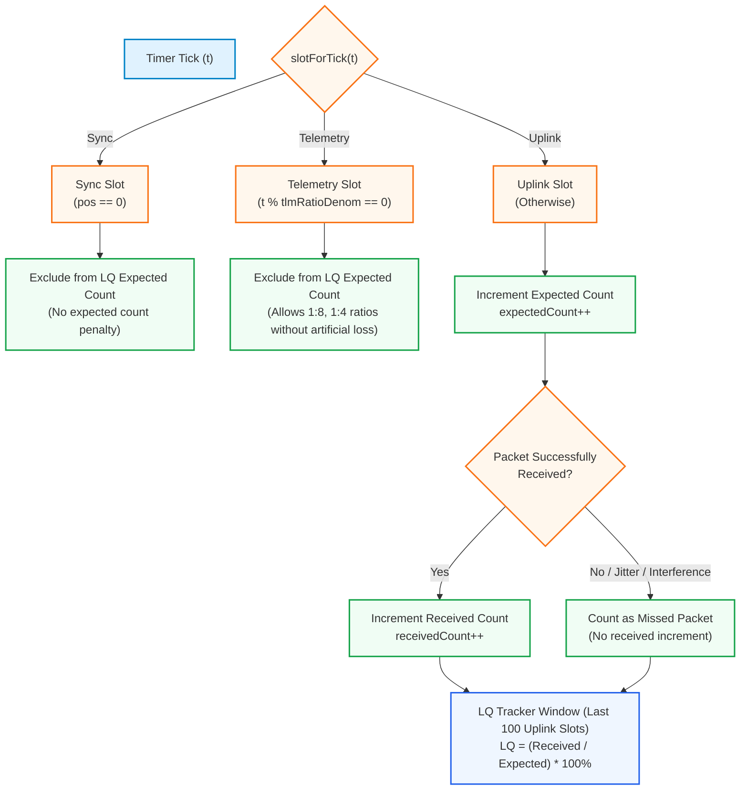

# Telemetry And Link Stats

Use direction-qualified names for telemetry:

- `downlink_telemetry`: RX to TX over the radio.
- `uplink_telemetry`: TX to RX over the radio, if added later.
- `crsf_link_statistics`: wired CRSF stats frame sent from RX to the flight controller.
- `link_stats`: internal health data, not serialized frame bytes.

Link quality accounting excludes Sync/Telemetry/Idle slots from uplink expected
counts. This prevents telemetry ratio from looking like packet loss.

See [architecture.md](architecture.md) and [configuration.md](configuration.md) for
current telemetry slotting and CRSF link-statistics behavior.
