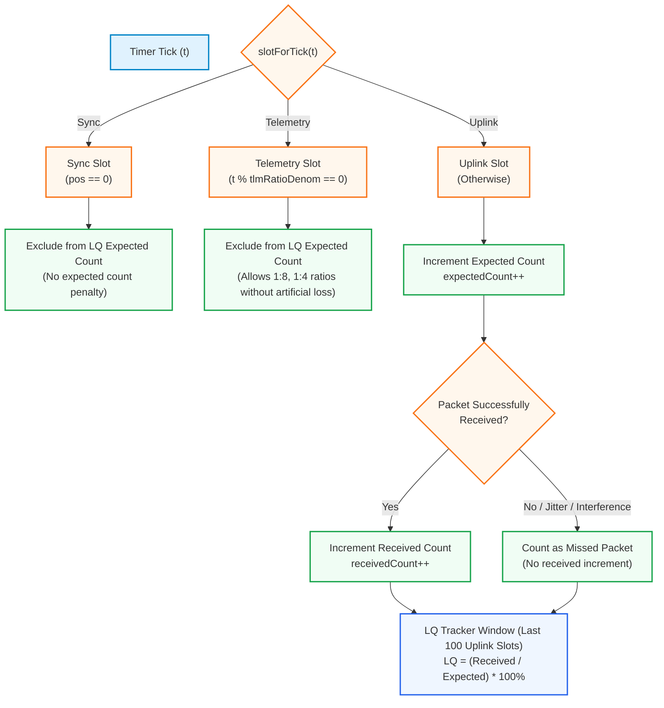

# Telemetry And Link Stats

Use direction-qualified names for telemetry:

- `downlink_telemetry`: RX to TX over the radio.
- `uplink_telemetry`: TX to RX over the radio, if added later.
- `crsf_link_statistics`: wired CRSF stats frame sent from RX to the flight controller.
- `link_stats`: internal health data, not serialized frame bytes.

Link quality accounting excludes Sync/Telemetry/Idle slots from uplink expected
counts. This prevents telemetry ratio from looking like packet loss.

## CRSF Link Statistics

XLRS emits the standard 10-byte CRSF `LINK_STATISTICS` payload. The fields are
direction-qualified:

| CRSF field | XLRS source |
| --- | --- |
| `uplink_RSSI_1` | RX-measured RSSI for TX-to-RX uplink frames |
| `uplink_RSSI_2` | Reserved for future diversity; currently `0` |
| `uplink_Link_quality` | RX-measured uplink LQ |
| `uplink_SNR` | RX-measured uplink SNR |
| `active_antenna` | Reserved for future diversity; currently `0` |
| `rf_Mode` | Active XLRS rate index |
| `uplink_TX_Power` | Reserved until TX power is mapped into CRSF power enums; currently `0` |
| `downlink_RSSI` | TX-measured RSSI for RX-to-TX telemetry frames |
| `downlink_Link_quality` | TX-measured telemetry-slot success rate |
| `downlink_SNR` | TX-measured SNR for RX-to-TX telemetry frames |

When downlink telemetry is stale, TX reports zero uplink and downlink CRSF link
statistics to the handset. RX-side CRSF link statistics sent to the flight
controller report the RX uplink view and leave downlink-only fields at zero
because RX cannot measure TX reception of telemetry slots.

## Downlink Telemetry Payload

RX-to-TX `downlink_telemetry` uses a versioned payload when telemetry slots are
enabled:

| Byte | Field |
| ---: | --- |
| 0 | payload version (`1`) |
| 1 | `uplink_lq` |
| 2 | `uplink_rssi_dbm * -1` |
| 3 | `uplink_snr_db` |
| 4 | `rf_mode` |
| 5 | `uplink_tx_power` CRSF enum, or `0` when unavailable |
| 6 | XLRS diagnostic fault flags |
| 7 | current `fhss_index` |
| 8 | expected `fhss_index` |
| 9 | `phase_error_us / 10`, clamped to int8 |
| 10 | lost connection count, saturated at 255 |
| 11 | rejected OTA frame count, saturated at 255 |

The decoder still accepts the legacy 4-byte payload
`uplink_lq, uplink_rssi_dbm * -1, uplink_snr_db, rf_mode` so mixed bench
firmware does not immediately reject older RX telemetry.

Fault flags:

| Flag | Meaning |
| --- | --- |
| `0x01` | uplink is stale at RX |
| `0x02` | config defaulted from invalid flash-backed config |
| `0x04` | RX scheduler is not connected / FHSS is not locked to usable uplink |
| `0x08` | PFD phase error bucket exceeds the timing-drift threshold |
| `0x10` | one or more OTA frames were rejected by CRC/type/UID checks |

```mermaid
graph TD
    classDef tick fill:#e0f2fe,stroke:#0284c7,stroke-width:2px;
    classDef decision fill:#fff7ed,stroke:#f97316,stroke-width:2px;
    classDef action fill:#f0fdf4,stroke:#16a34a,stroke-width:2px;
    classDef stat fill:#eff6ff,stroke:#2563eb,stroke-width:2px;

    Tick["Timer Tick (t)"]:::tick
    SlotType{"slotForTick(t)"}:::decision

    SyncSlot["Sync Slot<br/>(pos == 0)"]:::decision
    TlmSlot["Telemetry Slot<br/>(t % tlmRatioDenom == 0)"]:::decision
    UplinkSlot["Uplink Slot<br/>(Otherwise)"]:::decision

    ExcludeSync["Exclude from LQ Expected Count<br/>(No expected count penalty)"]:::action
    ExcludeTlm["Exclude from LQ Expected Count<br/>(Allows 1:8, 1:4 ratios without artificial loss)"]:::action

    IncExpected["Increment Expected Count<br/>expectedCount++"]:::action

    RxSuccess{"Packet Successfully<br/>Received?"}:::decision
    IncReceived["Increment Received Count<br/>receivedCount++"]:::action
    MissSlot["Count as Missed Packet<br/>(No received increment)"]:::action

    ComputeLQ["LQ Tracker Window (Last 100 Uplink Slots)<br/>LQ = (Received / Expected) * 100%"]:::stat

    SlotType -->|Sync| SyncSlot
    SlotType -->|Telemetry| TlmSlot
    SlotType -->|Uplink| UplinkSlot

    SyncSlot --> ExcludeSync
    TlmSlot --> ExcludeTlm

    UplinkSlot --> IncExpected
    IncExpected --> RxSuccess

    RxSuccess -->|Yes| IncReceived
    RxSuccess -->|No / Jitter / Interference| MissSlot

    IncReceived --> ComputeLQ
    MissSlot --> ComputeLQ
```

See [architecture.md](architecture.md) and [configuration.md](configuration.md) for
current telemetry slotting and CRSF link-statistics behavior.
