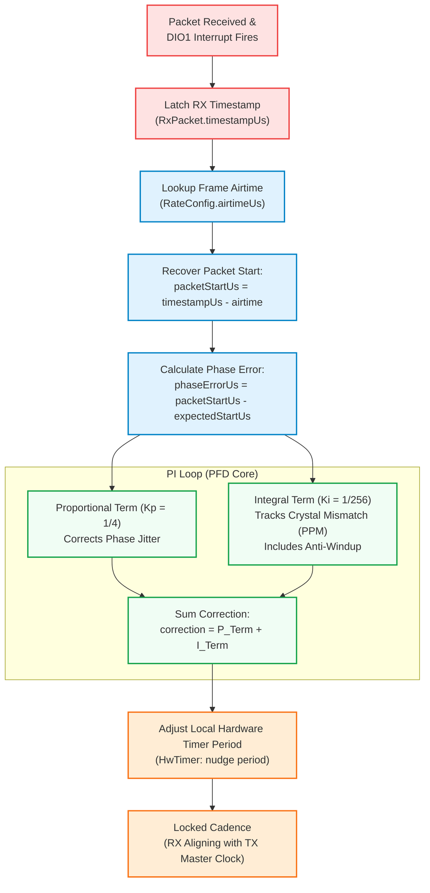

# Timing And Scheduler

`RfScheduler` owns the fast per-tick sequence:

- Slot selection.
- FHSS advancement.
- OTA encode/decode handoff.
- TX/RX turnaround.
- PHY TX/RX calls.
- Timing health counters.

`Link` owns slower lifecycle policy: bind, connect, connected, failsafe, and
link stats. Do not move per-tick scheduling decisions into `Link`, and do not
move lifecycle policy into `RfScheduler`.

Rules:

- TX is the time master.
- RX runs the PFD/PI loop.
- Timer ISR latches timestamp / increments an event counter only.
- DIO ISR latches event/timestamp only.
- RF task handles slot work, SPI, OTA codec, and PHY operations.
- Packet-start timing is recovered as RX timestamp minus airtime.

See [architecture.md](architecture.md) for the full design rationale.
